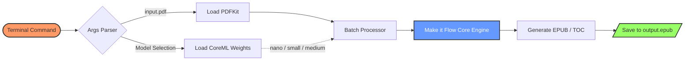
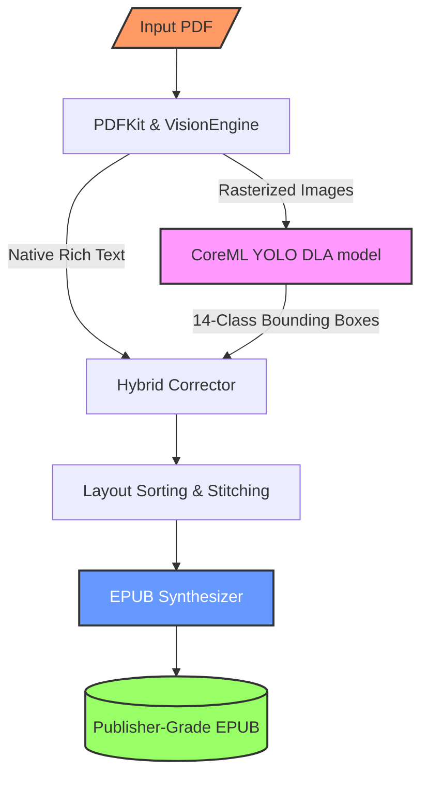

# Make it Flow 

**Make it Flow** is a 100% on-device iOS App & CLI tool that converts PDF documents into beautifully formatted, highly readable EPUB files. Powered by CoreML YOLO models and PDFKit, it intelligently reconstructs complex document architectures entirely offline.

[](https://apps.apple.com/tw/app/make-it-flow/id6780764422?l=en-GB)

## 🚀 Getting Started

### Requirements
* macOS 14.0+ / Xcode 15.0+ / iOS 17.0+

### Running the iOS App
1. Clone the repository: `git clone https://github.com/codinguniversefromEric/Make_it_Flow.git`
2. Open `Flow_1.xcodeproj` in Xcode.
3. Select a simulator or physical device, and press `Cmd + R` to build and run. (YOLO models are built-in, no external downloads required)

### Running the CLI
Ideal for batch processing, automations, or CI pipelines.
```bash
cd Flow_CLI
swift run Flow_CLI /path/to/input.pdf /path/to/output.epub [nano|small|medium]
```



## 🧠 Architecture Overview

The system pipeline is designed for high-performance extraction of academic papers and heavily formatted books:



1. **VisionEngine**: Executes YOLO to classify 14 types of layout regions (Title, Body, Table, Picture, Formula, etc.).
2. **Hybrid Corrector**: Combines YOLO's skeletal bounding boxes with native coordinate data extracted by PDFKit to perform precise alignment and text assignment.
3. **Layout Sorting**: Computes geometric topological sorting, Y-axis alignment, and handles cross-page sentence stitching.
4. **EPUB Synthesizer**: Compiles the parsed fragments into a strict, publisher-grade EPUB ZIP archive with responsive CSS.

## 📊 Models & Benchmarks

The project comes pre-packaged with three lightweight CoreML models based on [hantian/yolo-doclaynet](https://huggingface.co/hantian/yolo-doclaynet/tree/main). All models execute 100% offline leveraging Apple's Neural Engine.

| Model | Average Processing Time (per page) | Layout Similarity (Accuracy) | Edit Distance | Recommended Use Case |
|-------|------------------------------------|-----------------------------|---------------|----------------------|
| **YOLOv26 Nano** | **~0.05 seconds** | **~0.60** | **0.710** | Fast, battery-efficient. Good for standard text documents. |
| **YOLOv26 Small** | **~0.05 seconds** | **~0.65** | **0.656** | Good balance of speed and precision for standard devices. |
| **YOLOv26 Medium** (Default) | **~0.06 seconds** | **~0.83** | **0.330** | **Default**. Highest accuracy. Ideal for complex, multi-column academic papers with dense tables and charts. |

*Note: Benchmarks were measured on Apple Silicon (M-series) against the Hugging Face `marker_benchmark` dataset. The built-in Swift engine merges deep layout bounding boxes with native PDFKit data, generating accurate EPUB architectures orders of magnitude faster than Python-based alternatives.*

## ⚖️ License & Acknowledgements

* Code License: **AGPL-3.0**
* YOLO Framework: [Ultralytics YOLOv8](https://github.com/ultralytics/ultralytics) (AGPL-3.0)
* Model Weights: [hantian/yolo-doclaynet](https://huggingface.co/hantian/yolo-doclaynet/tree/main)

*⚠️ Note: The "Make it Flow" brand name, App Store presence, and UI/UX designs are the exclusive property of the author. Repackaging and publishing the app to the App Store without authorization is strictly prohibited.*
